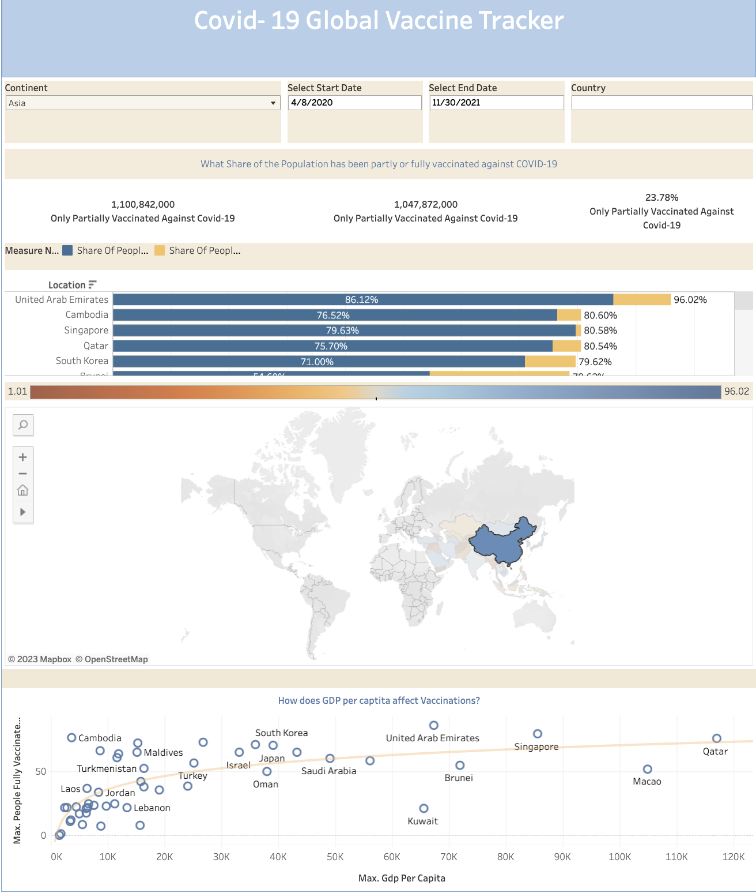

# tableau-visuals
A repository to gather a collections of all my tableau creations

[Come check out my Tableau Dashboard!]('https://public.tableau.com/app/profile/brandon.navarrete')

# Snapshot 
# New York Times Bestseller
A tableau dashboard to accompany my team's project. The goal of this project was to create an NLP / Classification that was able to predict if books had been a top New York Times bestseller. Come Check the [GitHub]('https://github.com/Booookkkkkssss/books_main#readme')

This is an interactive dashboard that shows what authors have made the list, given a time period, and which of their books represented them.
Another feature allowed us to see what publishers had a heavier presence and what authors were representing them.

# Covid Map

